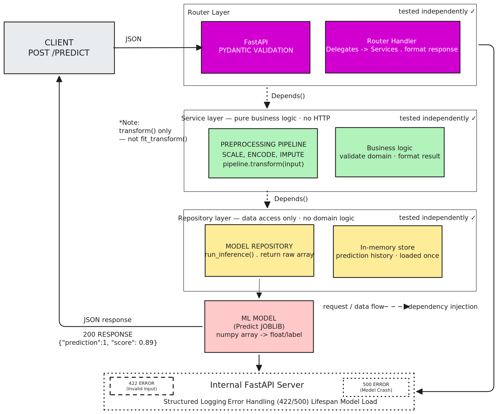

# Week 11 — Clean Architecture & Layered Design

**Phase 3: Docker & Clean Architecture**
**Periode: 18–23 Mei 2026**
**Project: Risk Scoring API — Refactored**

---

## Overview

Week 11 adalah minggu refactor penuh. Codebase yang sudah berjalan sejak Week 8 dibongkar dan dibangun ulang bukan karena tidak bekerja — tapi karena kode yang *works* belum tentu kode yang *maintainable*. Minggu ini membuktikan perbedaan antara keduanya.

Lima topik dikerjakan secara berurutan dan saling membangun:

| Hari | Topik | Inti |
|------|-------|------|
| D01 | Layered Architecture | Pisah tanggung jawab ke 3 layer |
| D02 | Router → Service → Repository Pattern | Implementasi nyata tiap layer |
| D03 | Dependency Injection | Cara layer saling bergantung tanpa melanggar batas |
| D04 | Separation of Concerns | Audit diagnostik per file |
| D05 | Testing Tiap Layer | Unit test terisolasi per layer |
| D06 | Review & Polish | Audit menyeluruh + update arsitektur |

---

## Architecture

```
week-11/app/
├── model/
│   ├── __init__.py
│   └── loader.py          ← load_model() — infrastructure only
├── routers/
│   └── predict.py         ← routing + Pydantic validation + Depends()
├── schemas/
│   └── prediction.py      ← input/output schema, tidak berubah dari W08
├── services/
│   └── model_service.py   ← business logic murni, tanpa HTTP knowledge
├── repositories/
│   └── prediction_repo.py ← akses data, return raw — tanpa domain logic
├── main.py
└── config.py
```

### Architecture Diagram v2 (W11 Refactored)



Diagram menunjukkan:
- **3 layer terpisah** dengan batas tanggung jawab yang jelas
- **Garis putus-putus** = dependency injection via `Depends()`
- **"tested independently"** = setiap layer bisa ditest tanpa layer lain
- **Aliran request**: Client → Router → Service → Repository → ML Model

---

## Layer Responsibilities

### Router layer — `routers/predict.py`

**Boleh:** terima request, validasi format via Pydantic, delegate ke service, return response, translate exception → HTTP status.

**Tidak boleh:** business logic, query database langsung, import sklearn/joblib, mengambil keputusan domain apapun.

```python
@router.post("/predict", response_model=PredictionResponse)
async def predict(
    input_data: PredictionInput,
    service: ModelService = Depends(get_model_service)  # DI, bukan instantiasi langsung
):
    result = service.predict(input_data)
    return PredictionResponse(**result)
```

---

### Service layer — `services/model_service.py`

**Boleh:** business logic, orchestrasi, keputusan domain (tier, label, score), raise `ValueError` / `RuntimeError`.

**Tidak boleh:** `import FastAPI`, `import HTTPException`, `import Request`, query database langsung, tahu detail HTTP apapun.

```python
class ModelService:
    def __init__(self, repo: ModelRepository, version: str = "1.0.0"):
        self.repo = repo
        self.version = version

    def predict(self, input_data: PredictionInput) -> dict:
        # Business logic murni — tidak tahu soal HTTP
        result = self.repo.run_inference(input_data)
        return {"prediction": int(result[0]), "score": float(result[1])}
```

---

### Repository layer — `repositories/prediction_repo.py`

**Boleh:** akses data, run inference, simpan history, return objek bersih atau `None`.

**Tidak boleh:** business logic, keputusan domain, raise `HTTPException`, tahu format response client.

```python
class PredictionRepository:
    def __init__(self, model, store: list):
        self.model = model
        self.store = store  # in-memory, diganti DB di W13

    def run_inference(self, input_array: np.ndarray) -> np.ndarray:
        # Kembalikan raw output — keputusan interpretasi ada di service
        return self.model.predict_proba(input_array)
```

---

## Dependency Injection

DI memastikan tidak ada layer yang mengurus pengadaan dependensinya sendiri. Semua disediakan dari luar.

### lru_cache vs app.state via Lifespan

| Aspek | `lru_cache` | `app.state` via Lifespan |
|-------|-------------|--------------------------|
| Di mana state disimpan | Module-level cache | Object `app.state` FastAPI |
| Kontrol lifecycle | Otomatis (Python GC) | Eksplisit — ditulis di `lifespan()` |
| Bisa di-reset tanpa restart? | Tidak — butuh `cache_clear()` | Ya — assign ulang `app.state.model` |
| Testability | Butuh `cache_clear()` antar test | Override langsung via `app.state` |
| Cocok untuk | Model stateless sklearn | Resource dengan open/close (DB pool, HTTP client) |

**Keputusan Week 11:** `lru_cache` — model sklearn stateless, tidak butuh cleanup. `app.state` via Lifespan menjadi relevan di W13 saat database connection pool masuk.

---

## Separation of Concerns — 5 Pertanyaan Diagnostik

Tanyakan ini ke setiap file sebelum commit:

1. File ini `import FastAPI` / `HTTPException` / `Request` — dan bukan `routers/` atau `main.py`? → **Pelanggaran.**
2. Ada `model.predict()` di file ini — dan bukan `services/`? → **Pelanggaran.**
3. Ada `raise HTTPException` di `services/`? → **Pelanggaran. Ganti dengan `raise ValueError`.**
4. Ada business decision (`if score > 0.7`) di `repositories/`? → **Pelanggaran. Pindah ke service.**
5. Ada database query di `routers/`? → **Pelanggaran. Pindah ke repository.**

### None adalah Fakta, 404 adalah Interpretasi

`Repository.get_by_id()` mengembalikan `None` jika data tidak ditemukan — bukan `raise HTTPException(404)`. Repository tidak tahu konteks aplikasinya. `None` adalah fakta data. Keputusan apakah itu 404, fallback, atau alert — adalah urusan layer di atasnya.

---

## Testing

### Prinsip Utama

Setiap layer ditest secara terpisah — tanpa menjalankan server, tanpa database nyata, tanpa layer lain yang ikut campur.

```
tests/
├── test_schema.py       ← test Pydantic validation (5 test cases)
├── test_service.py      ← test business logic, repo di-mock (4 test cases)
└── test_endpoint.py     ← test router via TestClient + dependency_overrides (3 test cases)
```

### Hasil Test — W11D06

```
12 passed in 3.57s

tests/test_endpoint.py::test_predict_endpoint_returns_200          PASSED
tests/test_endpoint.py::test_predict_endpoint_rejects_bad_input    PASSED
tests/test_endpoint.py::test_predict_called_service_with_correct_data PASSED
tests/test_schema.py::test_valid_input_accepted                    PASSED
tests/test_schema.py::test_invalid_input_raises_validation_error   PASSED
tests/test_schema.py::test_missing_required_field_raises           PASSED
tests/test_schema.py::test_infinite_value_raises                   PASSED
tests/test_schema.py::test_negative_value_raises                   PASSED
tests/test_service.py::test_predict_returns_result                 PASSED
tests/test_service.py::test_predict_raises_for_empty_list          PASSED
tests/test_service.py::test_predict_calls_repo_once                PASSED
tests/test_service.py::test_predict_handles_repo_error_and_preserves_cause PASSED
```

### Pola Test Per Layer

**Schema test** — validasi langsung tanpa mock:
```python
def test_negative_value_raises():
    with pytest.raises(ValidationError):
        PredictionInput(age=-1, income=50000)
```

**Service test** — repo di-mock dengan `MagicMock`:
```python
def test_predict_calls_repo_once(mock_repo):
    service = ModelService(repo=mock_repo)
    service.predict(valid_input)
    mock_repo.run_inference.assert_called_once_with(valid_input)
```

**Endpoint test** — `TestClient` + `dependency_overrides` (tidak perlu server running):
```python
def test_predict_endpoint_returns_200(client):
    response = client.post("/predict", json={"age": 28, "income": 50000})
    assert response.status_code == 200
```

### return_value vs side_effect

| Atribut | Perilaku | Kapan digunakan |
|---------|----------|-----------------|
| `return_value` | Selalu kembalikan nilai yang sama | Sukses path, nilai statis |
| `side_effect` | Raised exception atau nilai dinamis | Error path, data berubah per call |

### Error Chain — `from e` vs `from None`

```python
# from e — __cause__ terjaga (test: assert excinfo.value.__cause__ is not None)
raise RuntimeError("Inference failed") from e

# from None — chain diputus (test: assert excinfo.value.__cause__ is None)
raise RuntimeError("Inference failed") from None
```

---

## Layer Audit Results — W11D06

| Pemeriksaan | Hasil |
|-------------|-------|
| `from fastapi` di `services/` | ✅ Bersih |
| `HTTPException` di `services/` | ✅ Bersih |
| `import sklearn/joblib` di `routers/` | ✅ Bersih |
| `if score` / domain logic di `repositories/` | ✅ Bersih |
| `Service()` / `Repository()` tanpa `Depends()` di router | ✅ Bersih |
| All tests passing | ✅ 12/12 |

---

## Tech Stack

- Python 3.14.3
- FastAPI
- Pydantic v2
- scikit-learn / joblib
- pytest + pytest-anyio
- unittest.mock (MagicMock, patch)

---

## Commit

```
refactor(w11): clean architecture review & polish

- fix layer violations found during audit
- ensure consistent DI across all endpoints
- update architecture diagram to reflect refactored structure
- all tests passing after refactor
```

---

## Next — Week 12

Lanjut ke **observability dan monitoring**: structured logging yang lebih dalam, request tracing, dan health check endpoint yang bermakna. Bukan sekadar `{"status": "ok"}`.

---

*Week 11 selesai — lolivampire/ML-Project*