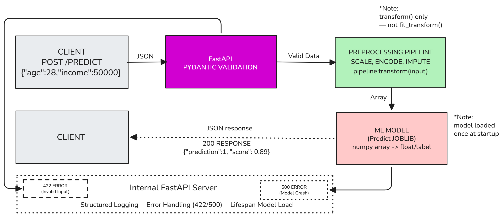

# 🎯 Risk Scoring API


> Production-ready ML API for credit risk assessment — deployed on Railway.

[](https://ml-project-production-f8a9.up.railway.app)
[](https://python.org)
[](https://fastapi.tiangolo.com)

**Live URL:** https://ml-project-production-f8a9.up.railway.app  
**Docs:** https://ml-project-production-f8a9.up.railway.app/docs

## About

This API predicts credit risk probability from applicant financial features
using a trained scikit-learn pipeline. Input 4 numeric features, get back a
binary prediction (0/1) and confidence score — all in under 200ms.

Built as Project 1 of a 24-week ML Engineering roadmap.

## Architecture




| Component | Technology |
|-----------|------------|
| API Framework | FastAPI |
| ML Model | scikit-learn Pipeline |
| Serialization | joblib |
| Deployment | Railway (free tier) |
| Testing | Postman + custom load tester | 

## Quick Start

```bash
git clone https://github.com/lolivampire/ML-Project
cd ML-Project/WEEK-8
pip install -r requirements.txt
uvicorn app.main:app --reload
```

API will be available at `http://localhost:8000`  
Interactive docs: `http://localhost:8000/docs`

## API Reference

### POST /predict

Predicts probability from features

**Request:**
```bash
curl -X POST https://ml-project-production-f8a9.up.railway.app/predict \
  -H "Content-Type: application/json" \
  -d '{
  "feature_1": 1.5,
  "feature_2": -0.5,
  "feature_3": 2.1,
  "feature_4": 0.8
}'
```

**Response (from production):**
```json
{
    "prediction": 1,
    "probability": 0.9749037006066681,
    "model_version": "pipe_v1"
}
```
**Response legend:**
- `prediction`: `1` = high risk, `0` = low risk
- `probability`: confidence score (0.0 – 1.0)
- `model_version`: model identifier for traceability

### GET /health

Returns API status and model information.
**Response:**
```json
{
  "status": "ok",
  "model": "pipe_v1"
}
```


## Limitations & Known Issues

- **Cold start latency**: First request after inactivity may take 2–5s
  (Railway free tier hibernates idle services)
- **Model version**: No versioning system — model is a single `.joblib` file.
  Updates overwrite without history.
- **No authentication**: All endpoints are public. Not suitable for production
  sensitive data without adding auth middleware.
- **Payload size**: No hard limit enforced beyond Pydantic validation.
  Large batch inputs not supported.
- **Free tier constraints**: Railway free tier has memory and CPU limits.
  Not benchmarked beyond 50 concurrent users.

## Load Test Results

| Metric | Value |
|--------|-------|
| Total requests | 15 |
| Concurrent users | 5 |
| Success rate | 100% |
| Throughput | 15.9 req/s |
| Median latency | 170ms |
| p95 latency | 565ms |